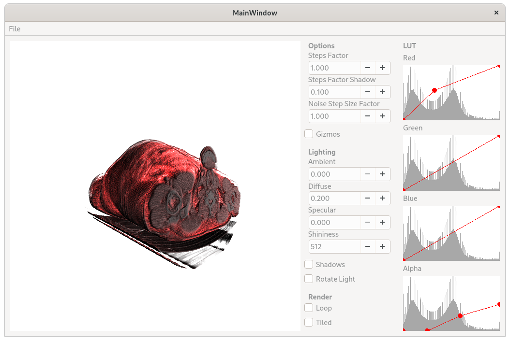
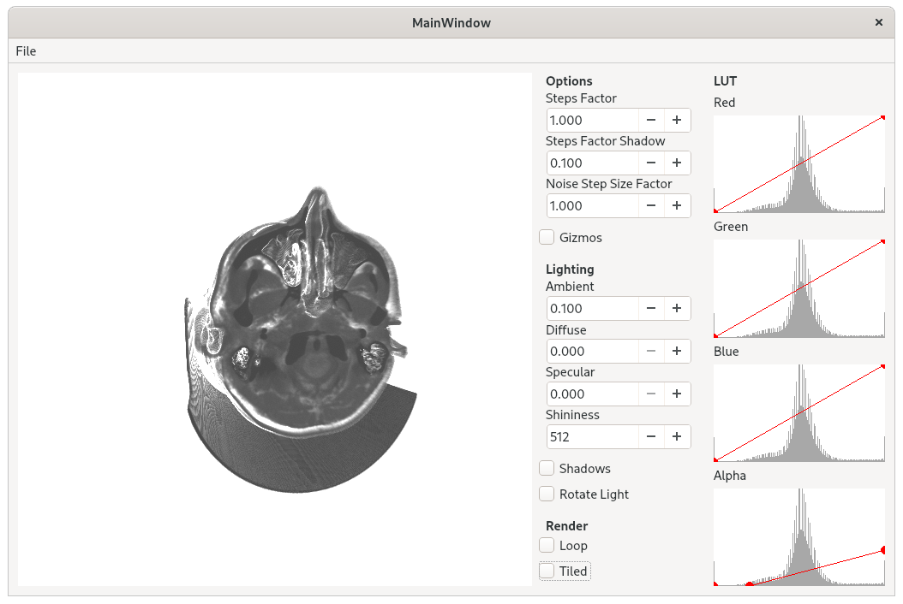

# Volume Rendering
A simple OpenGL volume renderer. Qt 5 used as the base framework.

## Features
- Interactive transfer function.
- Volume shadows.
- Ray casting rasterization acceleration.

A more detailed documentation can be found [here](https://github.com/GerardMT/Volume-Rendering/tree/master/docs/report/report.pdf).

## Known issues
- The renderer crashes when the performance is low. This is due to some graphic drivers killing the process if a draw call take longer than a few seconds. Can be mitigated by using the tiled rendering.

## Requirements
The software requires the following libraries to be installed:
- GLEW
- Eigen
- QT 5

## Build
Clone the repository:

	git clone https://github.com/GerardMT/Volume-Rendering
	cd Volume-Rendering

Compile the code:

    cd src
    qmake-qt5
    make

The builds can be found at `build/`.

## Run
Once build, run the project from the build directory:

	cd ../build/release/
	./volume-rendering

Sample volumes can be found at `res/volumes/`.

## Screenshots
 